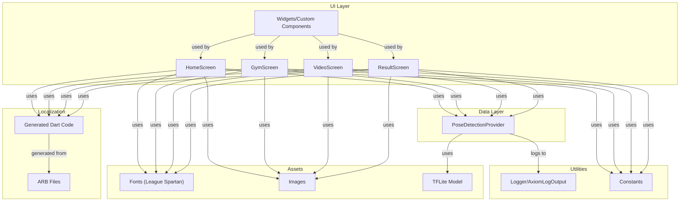

# PeakForm

PeakForm is a cross-platform Flutter fitness application that leverages real-time pose detection, beautiful UI, and internationalization to deliver a modern, responsive user experience. The app is architected for maintainability, testability, and extensibility, following best practices in Flutter app development.

---

## Features

- **Multi-Screen UI:** Includes Home, Gym, Video, and Result screens, each with a modern, responsive design.
- **Real-Time Pose Detection:** Uses TensorFlow Lite (MoveNet) for pose estimation via the device camera.
- **Feedback System:** Provides dynamic, categorized feedback (good, bad, tips) after each session, with visually distinct tooltips and cards.
- **Internationalization (i18n):** Supports English and German, with easy extensibility for more languages.
- **Custom Theming:** Uses a consistent color palette and the League Spartan font family for a unique look and feel.
- **State Management:** Utilizes the Provider package for scalable, testable state management.
- **Robust Logging:** Integrates with Axiom for production logging and uses the logger package for structured logs.
- **Test Coverage:** Includes widget and provider tests for reliability.
- **Asset Management:** Bundles custom fonts, images, and a TFLite model for pose detection.

---

## Project Structure

```
lib/
  main.dart                # App entry point, routing, theming, localization
  home_screen.dart         # Home screen UI and navigation
  gym_screen.dart          # Gym feature screen
  video_screen.dart        # Video/recording screen
  result_screen.dart       # Result/feedback screen
  constants/               # App-wide color and style constants
  l10n/                    # Localization (ARB files, generated Dart code)
  providers/               # State management (PoseDetectionProvider)
  util/                    # Utilities (Axiom logging, etc.)
  widgets/                 # Reusable widgets (PosePainter, etc.)
assets/
  fonts/                   # League Spartan font (Regular, Medium, SemiBold, Bold, Variable)
  models/3.tflite          # MoveNet SinglePose Lightning model
  *.jpg, *.png             # App images
test/                      # Unit and widget tests
```

---

## Getting Started

### Prerequisites

- Flutter SDK (>=2.18.0 <4.0.0)
- Dart
- Device/emulator with camera support (for pose detection)

### Installation

1. **Clone the repository:**
   ```sh
   git clone <your-repo-url>
   cd PeakForm
   ```

2. **Install dependencies:**
   ```sh
   flutter pub get
   ```

3. **Set up environment variables:**
   - Copy `.env.example` to `.env` and fill in your Axiom credentials if you want production logging.

4. **Run the app:**
   ```sh
   flutter run
   ```

---

## Architecture

- **UI Layer:** Stateless and stateful widgets for screens and components.
- **Data Layer:** Providers for business logic and state (e.g., pose detection).
- **Utilities:** Logging, constants, and helpers.
- **Internationalization:** ARB files and generated Dart code for i18n.

See [flutter-app-architecture](#) for more details on the architectural approach.

### Architecture Diagram



---

## Key Technologies

- **Flutter**: UI framework
- **Provider**: State management
- **TensorFlow Lite**: Pose detection (MoveNet)
- **Axiom**: Production logging
- **Intl/Flutter Localizations**: i18n
- **League Spartan**: Custom font

---

## Theming & Fonts

- All text uses the League Spartan font family (Regular, Medium, SemiBold, Bold, Variable).
- Color palette is defined in `lib/constants/constants.dart` for easy customization.

---

## Localization

- English and German supported out of the box.
- Add new languages by creating additional ARB files in `lib/l10n/` and running:
  ```sh
  flutter gen-l10n
  ```

---

## Pose Detection

- Uses a bundled TFLite model (`assets/models/3.tflite`) for real-time pose estimation.
- Camera access is required; permissions are handled at runtime.

---

## Logging

- Uses the `logger` package for structured logs.
- In production, logs are sent to Axiom (if credentials are provided in `.env`).

---

## Testing

- Unit and widget tests are located in the `test/` directory.
- Run all tests with:
  ```sh
  flutter test
  ```

---

## Assets

- **Fonts:** League Spartan (all weights)
- **Images:** Gym, tennis, golf, running, etc.
- **Model:** MoveNet SinglePose Lightning (`3.tflite`)

---

## Contributing

Contributions are welcome! Please open issues and submit pull requests for improvements or bug fixes.

---

## License

This project is licensed under the MIT License.

---

## Acknowledgements

- [Flutter](https://flutter.dev/)
- [TensorFlow Lite](https://www.tensorflow.org/lite)
- [Axiom](https://axiom.co/)
- [Google Fonts - League Spartan](https://fonts.google.com/specimen/League+Spartan)
