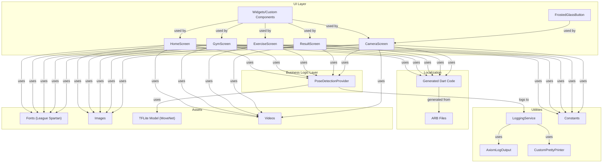

# PeakForm

PeakForm is a cross-platform Flutter fitness application that leverages real-time pose detection using TensorFlow Lite (MoveNet), beautiful UI, and internationalization to deliver a modern, responsive user experience. The app is architected for maintainability, testability, and extensibility, following best practices in Flutter app development.

---

## Features

- **Multi-Screen UI:** Includes Home, Gym, Video, Pose Detection, Camera, and Result screens, each with a modern, responsive design.
- **Modular Exercise Screens:** Exercise screens are fully modular, supporting dynamic titles, video assets, thumbnails, and execution steps passed from parent screens.
- **Real-Time Pose Detection:** Uses TensorFlow Lite (MoveNet SinglePose Lightning) for real-time pose estimation via the device camera with 17 keypoint detection.
- **Advanced Camera Integration:** Full camera control with zoom, focus, and gesture support for optimal pose detection.
- **Feedback System:** Provides dynamic, categorized feedback (good, bad, tips) after each session, with visually distinct tooltips and cards.
- **Internationalization (i18n):** Supports English and German, with easy extensibility for more languages.
- **Custom Theming:** Uses a consistent color palette and the League Spartan font family for a unique look and feel.
- **State Management:** Utilizes the Provider package for scalable, testable state management.
- **Production-Ready Logging:** Integrates with Axiom for production logging and uses the logger package for structured logs with device context.
- **Comprehensive Testing:** Includes widget, provider, and utility tests for reliability.
- **Asset Management:** Bundles custom fonts, images, and a TFLite model for pose detection.
- **Environment Configuration:** Supports environment variables for API keys and configuration.

---

## Project Structure

```
lib/
  main.dart                    # App entry point, routing, theming, localization
  home_screen.dart             # Home screen UI and navigation
  exercise_screen.dart         # Modular exercise screen (dynamic title, video, thumbnail, steps)
  result_screen.dart           # Result/feedback screen
  frosted_glasst_button.dart   # Custom frosted glass button component
  screens/                     # Screen components
    camera_screen.dart         # Camera functionality & pose detection
  widgets/                     # Reusable widgets
    pose_painter.dart          # Custom painter for pose visualization
  providers/                   # State management
    pose_detection_provider.dart # Pose detection business logic
  constants/                   # App-wide color and style constants
  l10n/                        # Localization (ARB files, generated Dart code)
  util/                        # Utilities
    axiom_log_output.dart      # Axiom logging integration
    custom_pretty_printer.dart # Custom log formatting
    logging_service.dart       # Centralized logging service
assets/
  fonts/                       # League Spartan font (Regular, Medium, SemiBold, Bold, Variable)
  models/3.tflite              # MoveNet SinglePose Lightning model
  images/                      # App images and thumbnails
  videos/                      # Exercise videos
  ...
test/                          # Unit and widget tests
  widget_test.dart             # Main widget tests
  pose_detection_provider_test.dart # Provider tests
  constants_test.dart          # Constants tests
  axiom_log_output_test.dart   # Logging tests
```

---

## Getting Started

### Prerequisites

- Flutter SDK (>=2.18.0 <4.0.0)
- Dart
- Device/emulator with camera support (for pose detection)
- Axiom account (optional, for production logging)

### Installation

1. **Clone the repository:**
   ```sh
   git clone <your-repo-url>
   cd PeakForm
   ```

2. **Install dependencies:**
   ```sh
   flutter pub get
   ```

3. **Set up environment variables:**
   Create a `.env` file in the root directory with the following variables:
   ```env
   AXIOM_API_TOKEN=your_axiom_api_token
   AXIOM_DATASET=your_axiom_dataset
   USER_ID=your_user_id
   USER_EMAIL=your_email
   USER_NAME=your_username
   ```

4. **Run the app:**
   ```sh
   flutter run
   ```

---

## Architecture

The app follows a clean architecture pattern with clear separation of concerns:

- **UI Layer:** Stateless and stateful widgets for screens and components. ExerciseScreen is modular and receives all content (title, video, thumbnail, steps) via constructor.
- **Business Logic Layer:** Providers for state management and business logic (e.g., pose detection).
- **Data Layer:** Services and utilities for data handling and logging.
- **Utilities:** Logging, constants, and helper functions.
- **Internationalization:** ARB files and generated Dart code for i18n.

### UI/UX Highlights
- **Centered Titles:** All major screens use a centered title in the app bar, with the exercise name shown below the video on exercise screens.
- **Flexible Execution Steps:** Execution steps are rendered in a row with a number and text that wraps to multiple lines as needed, never overflowing.
- **Dynamic Thumbnails & Videos:** ExerciseScreen supports dynamic asset passing for both video and thumbnail.

### Architecture Diagram



---

## Key Technologies

- **Flutter**: UI framework
- **Provider**: State management
- **TensorFlow Lite**: Pose detection (MoveNet SinglePose Lightning)
- **Camera**: Real-time camera access and control
- **Axiom**: Production logging with structured data
- **Intl/Flutter Localizations**: i18n
- **League Spartan**: Custom font
- **Permission Handler**: Camera permissions
- **Device Info Plus**: Device context for logging
- **Package Info Plus**: App version information
- **UUID**: Session tracking

---

## Pose Detection

### MoveNet Integration

- Uses MoveNet SinglePose Lightning model (`assets/models/3.tflite`) for real-time pose estimation
- Detects 17 keypoints: nose, eyes, ears, shoulders, elbows, wrists, hips, knees, and ankles
- Supports confidence thresholds and real-time visualization
- Camera access is required; permissions are handled at runtime

### Key Features

- **Real-time Processing**: Continuous pose detection at camera frame rate
- **Gesture Support**: Tap to focus, pinch to zoom
- **Visual Feedback**: Pose landmarks drawn on camera preview
- **Performance Optimized**: Low-resolution processing for better performance
- **Error Handling**: Graceful fallback when model loading fails

---

## Logging System

### Features

- **Structured Logging**: JSON-formatted logs with context
- **Production Integration**: Axiom integration for production environments
- **Device Context**: Automatic device information collection
- **Session Tracking**: Unique session IDs for request tracing
- **User Context**: User information for personalized logging
- **Screen Context**: Screen-level logging for user journey tracking

### Log Levels

- **Info**: General application flow
- **Warning**: Potential issues
- **Error**: Errors with stack traces

### Environment Support

- **Development**: Console output with pretty formatting
- **Production**: Axiom integration with structured data

---

## Theming & Fonts

- All text uses the League Spartan font family (Regular, Medium, SemiBold, Bold, Variable)
- Color palette is defined in `lib/constants/constants.dart` for easy customization
- Consistent design language across all screens

---

## Localization

- English and German supported out of the box
- Add new languages by creating additional ARB files in `lib/l10n/` and running:
  ```sh
  flutter gen-l10n
  ```

---

## Testing

### Test Coverage

- **Widget Tests**: UI component testing
- **Provider Tests**: State management testing
- **Utility Tests**: Helper function testing
- **Integration Tests**: End-to-end functionality testing

### Running Tests

```sh
# Run all tests
flutter test

# Run specific test file
flutter test test/pose_detection_provider_test.dart

# Run with coverage
flutter test --coverage
```

---

## Environment Configuration

The app supports environment-based configuration through a `.env` file:

```env
# Axiom Logging (Production)
AXIOM_API_TOKEN=your_axiom_api_token
AXIOM_DATASET=your_axiom_dataset

# User Context
USER_ID=your_user_id
USER_EMAIL=your_email
USER_NAME=your_username
```

---

## Assets

- **Fonts:** League Spartan (all weights)
- **Images:** Gym, tennis, golf, running, etc.
- **Model:** MoveNet SinglePose Lightning (`3.tflite`)
- **Videos:** Exercise demonstration videos

---

## Performance Considerations

- **Camera Resolution**: Uses low resolution for better performance
- **Model Optimization**: SinglePose Lightning model for faster inference
- **Memory Management**: Proper disposal of camera controllers and interpreters
- **Error Handling**: Graceful degradation when features are unavailable

---

## Contributing

Contributions are welcome! Please open issues and submit pull requests for improvements or bug fixes.

### Development Guidelines

1. Follow the existing code style and architecture patterns
2. Add tests for new functionality
3. Update documentation for new features
4. Ensure all tests pass before submitting

---

## License

This project is licensed under the MIT License.

---

## Acknowledgements

- [Flutter](https://flutter.dev/)
- [TensorFlow Lite](https://www.tensorflow.org/lite)
- [MoveNet](https://www.tensorflow.org/hub/tutorials/movenet)
- [Axiom](https://axiom.co/)
- [Google Fonts - League Spartan](https://fonts.google.com/specimen/League+Spartan)
